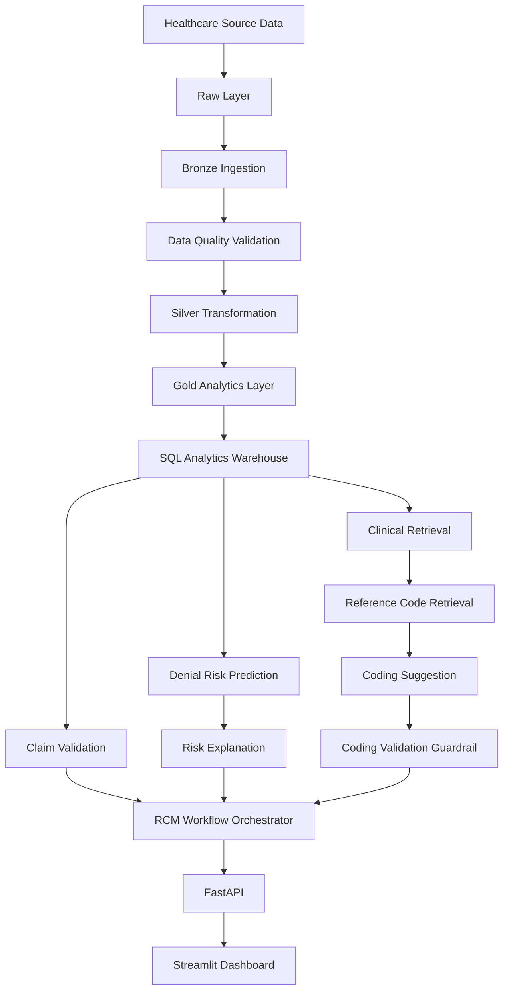

# Healthcare RCM Intelligence Platform

> **Version 1 — End-to-end healthcare RCM intelligence platform combining data engineering, machine learning, clinical retrieval, coding support, workflow orchestration, FastAPI, and Streamlit.**


## Overview

The **Healthcare RCM Intelligence Platform** is a portfolio-scale implementation of an end-to-end Revenue Cycle Management workflow.

The project was built to explore how reliable healthcare AI systems can be designed **from the data layer upward**, rather than starting with an LLM and adding controls later.

Version 1 combines:

- Data Engineering and medallion-style pipelines
- Data quality and lineage tracking
- SQL analytics
- Claim validation
- Machine-learning-based denial risk prediction
- Clinical note retrieval
- Evidence-grounded coding support
- Validation guardrails
- Multi-stage workflow orchestration
- FastAPI backend services
- Streamlit dashboard
- Automated testing

> **Important:** This project uses synthetic/demo healthcare data and simplified coding reference data. It is an educational and portfolio project, not a production medical coding, billing, or clinical decision system.

---

## Version 1 Architecture



---

## Core Capabilities

### 1. Data Engineering Pipeline

The platform follows a medallion-style architecture:

| Layer | Purpose |
|---|---|
| **Raw** | Original synthetic source datasets |
| **Bronze** | Source-preserved records plus ingestion metadata |
| **Silver** | Cleaned, standardized, typed, and validated data |
| **Gold** | Business-ready analytical marts and ML-ready datasets |

Bronze ingestion adds operational metadata such as:

- source file
- ingestion timestamp
- batch ID
- source row number

Core datasets include:

- Patients
- Providers
- Encounters
- Claims
- Claim Lines
- Clinical Notes
- Denials

---

### 2. Data Quality Framework

Validation includes checks for:

- null primary keys
- duplicate primary keys
- invalid dates
- negative monetary values
- invalid categorical values
- broken foreign-key relationships
- claim-status conformity

The pipeline is configured to stop when critical data-quality checks fail.

---

### 3. Gold Analytics Layer

The Gold layer contains business-oriented outputs including:

- `claim_summary`
- `denial_summary`
- `payer_performance`
- `patient_utilization`
- `claim_validation_report`
- `denial_ml_dataset`

These datasets are designed for downstream SQL analytics, machine learning, APIs, and dashboards.

---

### 4. SQL Analytics Warehouse

The project includes a local SQLite analytics warehouse containing Silver and Gold tables.

SQL exercises implemented in the project include:

- joins
- aggregations
- conditional aggregation
- `GROUP BY`
- `HAVING`
- CTEs
- `ROW_NUMBER()`
- `RANK()`
- `LAG()`
- running totals
- window functions

---

### 5. Claim Validation Engine

Individual claims are checked for structural and financial consistency, including:

- patient existence
- provider existence
- encounter existence
- claim-line availability
- positive claim amount
- claim amount vs. line-charge reconciliation
- paid amount vs. allowed amount
- denied-claim payment consistency

Claims can be validated individually or in batch.

---

### 6. Denial Risk Prediction

The project includes a Random Forest denial-risk model trained on synthetic claims.

Example features include:

- claim amount
- claim-line count
- total allowed amount
- payer
- provider specialty
- encounter type
- submission delay
- authorization status
- documentation completeness

On the current synthetic test split, the Random Forest model achieved approximately:

| Metric | Result |
|---|---:|
| Accuracy | 72.5% |
| Precision | 62.5% |
| Recall | 88.2% |
| F1 Score | 73.2% |

> These metrics come from a small synthetic test dataset and should **not** be interpreted as real-world healthcare performance.

The prediction service returns:

- denial probability
- predicted denial flag
- LOW / MEDIUM / HIGH risk level
- rule-based risk factors and recommendations

---

### 7. Clinical Retrieval and Grounding

Clinical notes are retrieved using **TF-IDF + cosine similarity**.

The retrieval pipeline preserves traceability through:

- note ID
- patient ID
- encounter ID
- similarity score
- supporting clinical text

A validation layer verifies that returned evidence actually exists in the retrieved context.

---

### 8. Evidence-Grounded Coding Support

The coding workflow combines two independent sources of support:

```text
Clinical Evidence
        +
Reference Code Retrieval
        ↓
Coding Suggestion
        ↓
Validation Guardrail
```

The coding assistant does not freely invent codes. Suggested codes must be present in retrieved reference-code candidates and linked back to supporting clinical evidence.

The included code reference data is intentionally small and simplified for demonstration purposes.

---

### 9. Workflow Orchestration

Version 1 includes a controlled Python orchestration layer that coordinates:

1. Claim Validation
2. Denial Prediction
3. Denial Explanation
4. Clinical Retrieval
5. Reference Code Retrieval
6. Coding Suggestion
7. Coding Validation

Workflow outcomes include:

- `SUCCESS`
- `STOPPED`
- `MANUAL_REVIEW`

The orchestrator deliberately keeps critical validation logic deterministic rather than delegating everything to an AI model.

---

### 10. FastAPI + Streamlit

The complete workflow is exposed through FastAPI and consumed by a Streamlit dashboard.

The dashboard displays:

- workflow status
- claim-validation status
- denial probability
- risk level
- denial risk factors
- suggested code
- coding-validation status
- supporting clinical evidence

---

## Project Structure

```text
Healthcare-RCM-Intelligence-Platform/
│
├── data/
│   ├── raw/
│   ├── bronze/
│   ├── silver/
│   ├── gold/
│   ├── reference/
│   └── warehouse/
│
├── src/
│   ├── ingestion/
│   ├── transformation/
│   ├── validation/
│   ├── analytics/
│   ├── ml/
│   ├── rag/
│   ├── agents/
│   ├── api/
│   └── pipeline.py
│
├── dashboard/
├── tests/
├── app/
├── requirements.txt
├── architecture.docx
└── README.md
```

---

## Run Locally

### 1. Clone the repository

```bash
git clone https://github.com/shafiq1805/Healthcare-RCM-Intelligence-Platform.git
cd Healthcare-RCM-Intelligence-Platform
```

### 2. Create and activate a virtual environment

```bash
python -m venv venv
```

Windows:

```bash
venv\Scripts\activate
```

### 3. Install dependencies

```bash
pip install -r requirements.txt
```

### 4. Run the data pipeline

```bash
python src/pipeline.py
```

### 5. Run tests

```bash
pytest -v
```

### 6. Start FastAPI

```bash
uvicorn src.api.main:app --reload
```

Swagger UI:

```text
http://127.0.0.1:8000/docs
```

### 7. Start Streamlit

In a second terminal:

```bash
streamlit run dashboard/app.py
```

---

## Example API Request

`POST /rcm/analyze`

```json
{
  "claim_id": "C00001",
  "clinical_question": "Patient has hypertension with elevated blood pressure."
}
```

The response can include claim-validation results, denial-risk scoring, risk explanations, coding suggestions, validation status, and supporting evidence.

---

## Observability

Pipeline execution is tracked using:

- execution ID
- pipeline step
- status
- start time
- end time
- duration
- error message

Audit information is written to the project logging layer for pipeline traceability.

---

## Technology Stack

**Data Engineering**  
Python · Pandas · SQLite · SQL

**Machine Learning**  
scikit-learn · Random Forest · joblib

**Retrieval / AI**  
TF-IDF · Cosine Similarity · Evidence Grounding · Validation Guardrails

**Application**  
FastAPI · Pydantic · Streamlit

**Engineering**  
Pytest · Pipeline Orchestration · Audit Logging

---

## Version 2 — In Progress

Version 1 intentionally uses a controlled Python workflow orchestrator.

**Version 2 is currently being designed as an advanced agentic RCM workflow.**

Planned areas of exploration include:

- AutoGen-style multi-agent orchestration
- Supervisor / coordinator agent
- Claim Validation Agent
- Denial Prevention Agent
- Clinical Retrieval Agent
- Medical Coding Agent
- Validation / Compliance Agent
- human-in-the-loop review
- structured agent-to-agent handoffs
- shared context and workflow state
- agent observability and audit trails
- semantic embeddings and vector search
- local LLM integration
- PySpark / Delta Lake / Databricks data-engineering upgrades

The design principle for V2 remains:

> **Agents for reasoning and orchestration. Deterministic tools for validation. Human review for consequential healthcare decisions.**

---

## Current Limitations

Version 1 is a portfolio and learning implementation. Current limitations include:

- synthetic healthcare data
- simplified demonstration code-reference datasets
- SQLite instead of a production database
- Pandas instead of distributed processing
- TF-IDF instead of semantic embedding retrieval
- rule-based risk explanations rather than full model explainability
- no production authentication or RBAC
- no containerized deployment yet

These limitations define the roadmap for future versions rather than being hidden behind the demo.

---

## Roadmap

- [x] Raw → Bronze → Silver → Gold pipeline
- [x] Data-quality validation
- [x] SQL analytics warehouse
- [x] Pipeline orchestration and observability
- [x] Claim validation engine
- [x] Denial-risk model
- [x] Clinical retrieval
- [x] Evidence-grounded coding support
- [x] Coding guardrails
- [x] FastAPI backend
- [x] Streamlit dashboard
- [x] Automated tests
- [ ] V2 agent framework integration
- [ ] Human-in-the-loop agent workflow
- [ ] Semantic vector retrieval
- [ ] Local LLM integration
- [ ] PySpark / Delta Lake / Databricks upgrade
- [ ] Dockerized deployment

---

## Author

**Shafiq Abubacker**  
Healthcare AI · Data Engineering · Machine Learning · Agentic AI

GitHub: [@shafiq1805](https://github.com/shafiq1805)

---

If this project is useful to you, feel free to explore the code, open an issue, or follow the repository as Version 2 evolves.
